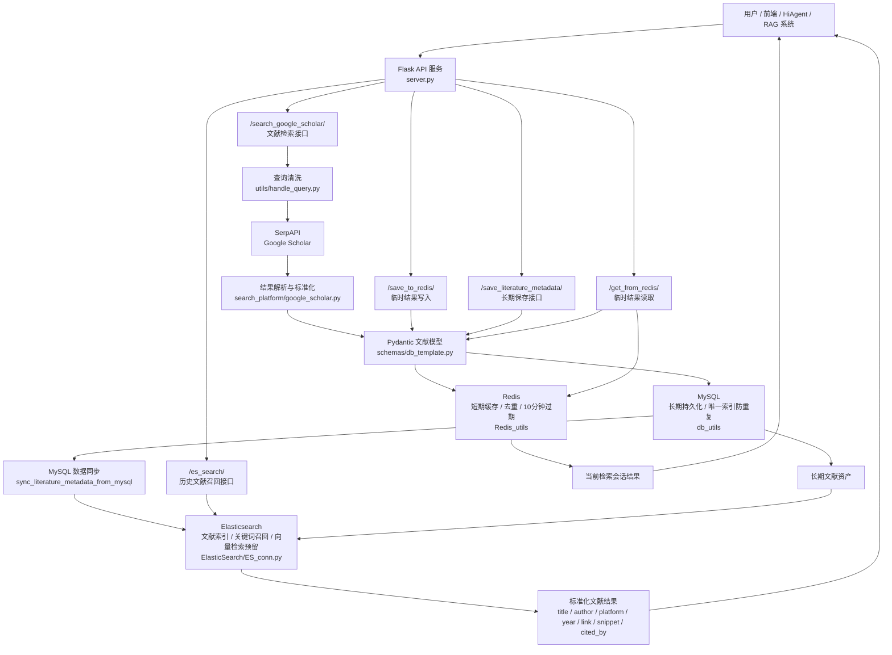

# 论文检索助手

论文检索助手是一个面向科研、课程项目、行业调研和智能体工作流的文献检索后端服务。它不是简单地把搜索结果原样返回，而是把“检索、结构化、暂存、持久化、二次召回”串成了一条完整链路：用户提出自然语言检索需求，系统从 Google Scholar 获取候选论文，将结果统一成标准文献元数据，再根据场景存入 Redis、MySQL，并通过 Elasticsearch 支持后续检索和智能体记忆召回。

这个项目适合被集成到论文推荐助手、科研问答 Agent、企业知识库、课程论文工具、实验室文献管理系统等场景中。它已经具备工程项目应有的分层结构、数据模型校验、去重策略、数据库初始化、检索接口和外部服务配置能力。

## 项目价值

传统文献检索工具往往停留在“查到一批结果”的阶段，后续仍需要人工整理标题、作者、年份、来源、摘要、引用次数和链接。论文检索助手解决的是更靠后的工程问题：如何把一次文献搜索变成可被系统长期使用、可被数据库保存、可被智能体再次召回的结构化资产。

项目的核心价值体现在四点：

1. **从搜索结果到标准数据**：统一把 Google Scholar 返回的数据整理为 `title`、`author`、`platform`、`year`、`link`、`snippet`、`cited_by`、`source` 等字段，方便前端展示、数据库存储和后续检索。
2. **从临时结果到长期资产**：Redis 用于短期暂存和前端交互，MySQL 用于长期保存和去重，Elasticsearch 用于快速召回，形成清晰的数据生命周期。
3. **从接口服务到智能体能力**：`/es_search/` 接口可以被 HiAgent、RAG 系统或其他智能体平台调用，让历史文献数据成为可检索的“记忆”。
4. **从脚本原型到可扩展后端**：项目采用 Flask 路由、Pydantic 数据模型、独立工具模块和环境变量配置，后续可以自然扩展更多检索平台、排序策略和前端页面。

## 核心功能

### 1. Google Scholar 文献检索

服务通过 SerpAPI 调用 Google Scholar，并支持按语言分别检索。例如前端可以传入中文和英文查询词，再分别指定每种语言需要返回的数量。

接口：

```http
POST /search_google_scholar/
```

请求示例：

```json
{
  "query_google_scholar": {
    "zh-CN": "四旋翼无人机 端到端 导航",
    "en": "end-to-end navigation for quadrotor UAV"
  },
  "lang_num": {
    "zh-CN": 5,
    "en": 5
  }
}
```

返回结果会被整理为统一结构：

```json
{
  "literature_search_results": [
    {
      "title": "论文标题",
      "author": "作者",
      "platform": "发表平台或期刊会议",
      "year": "发表年份",
      "link": "论文链接",
      "snippet": "摘要片段",
      "cited_by": 123,
      "source": "Google Scholar"
    }
  ]
}
```

实现位置：

- `search_platform/google_scholar.py`：负责调用 SerpAPI、解析 Google Scholar 结果、抽取作者/平台/年份/引用次数。
- `server.py`：提供 `/search_google_scholar/` 路由，并对传入 query 做清洗和多语言合并。
- `utils/handle_query.py`：处理查询字符串，避免空查询或多余引号影响检索。

### 2. 标准化文献元数据模型

项目使用 Pydantic 定义文献元数据模型，保证不同来源、不同接口、不同数据库之间的数据格式一致。无论搜索结果来自 Google Scholar、前端手动提交，还是未来新增的 arXiv、Semantic Scholar、CNKI 等平台，都可以复用同一套字段规范。

核心模型：

```python
class Literature_Metadata_Record(BaseModel):
    title: str
    author: str
    platform: str
    year: str
    link: str
    snippet: str
    cited_by: Optional[int]
    source: str
```

模型优势：

- 自动去除字符串字段前后空白。
- 将缺失字段统一转为空字符串或默认来源。
- 将 Google Scholar 中可能是字典结构的引用数字规范为整数。
- 在写入 Redis、MySQL 和返回前端之前进行统一校验。

实现位置：

- `schemas/db_template.py`
- `schemas/redis_template.py`

### 3. Redis 临时结果缓存

Redis 用于保存当前检索会话中的论文结果，适合前端“先检索、再筛选、再保存”的交互方式。系统会把每条文献元数据序列化为 JSON 字符串存入 Redis 列表，并在写入时进行去重。

接口：

```http
POST /save_to_redis/
GET /get_from_redis/
```

Redis 设计特点：

- 使用列表结构保存一次或多次检索得到的文献结果。
- 写入前将 JSON 排序序列化，避免字段顺序不同导致重复保存。
- 设置 600 秒过期时间，适合作为短期搜索结果缓存。
- 读取时再次通过 Pydantic 模型校验，保证返回给前端的数据稳定。

实现位置：

- `Redis_utils/init_redis.py`
- `Redis_utils/redis_func.py`

### 4. MySQL 长期持久化

MySQL 用于保存最终确认的文献元数据，是项目的长期数据资产层。服务启动时会自动初始化数据库和数据表，不需要手动建表。

接口：

```http
POST /save_literature_metadata/
```

表结构包含：

- `id`：自增主键
- `title`：论文标题
- `author`：作者
- `platform`：期刊、会议、网站或来源平台
- `year`：发表年份
- `link`：论文链接
- `snippet`：摘要片段
- `cited_by`：引用次数
- `source`：数据来源
- `created_at` / `updated_at`：创建与更新时间

数据库设计优势：

- 使用 `utf8mb4` 编码，兼容中文、英文和特殊字符。
- 对 `title + link` 建立唯一索引，避免同一论文重复入库。
- 使用 `INSERT IGNORE`，重复数据不会中断批量保存流程。
- 返回 `saved_count`、`received_count`、`duplicate_count`，方便前端展示保存结果。

实现位置：

- `db_utils/init_mysql_db.py`
- `db_utils/mysql_db_func.py`

### 5. Elasticsearch 二次检索与智能体召回

Elasticsearch 用于对已经保存的文献进行快速检索。相比每次都重新访问 Google Scholar，ES 更适合在用户历史文献库、团队知识库或智能体记忆中做二次召回。

接口：

```http
POST /es_search/
```

请求示例：

```json
{
  "query": "无人机 视觉语言导航",
  "literature_num": 3
}
```

返回示例：

```json
{
  "success": true,
  "returned_count": 3,
  "literature_metadata": [
    {
      "title": "论文标题",
      "author": "作者",
      "platform": "平台",
      "year": "2025",
      "link": "链接",
      "snippet": "摘要片段",
      "cited_by": 10,
      "source": "Google Scholar"
    }
  ]
}
```

实现特点：

- 自动初始化 Elasticsearch index。
- 为标题、作者、平台、摘要等字段建立可检索映射。
- 提供从 MySQL 批量同步到 Elasticsearch 的方法。
- 当前接口使用 `multi_match` 查询，适合关键词召回。
- 代码中已经预留 `dense_vector` 字段和 `hybrid_search` 方法，为后续向量检索和混合检索扩展打好基础。

实现位置：

- `ElasticSearch/ES_conn.py`

## 系统架构

### 项目框图

draw.io 源文件：[doc/project_architecture.drawio](doc/project_architecture.drawio)



```text
用户 / 前端 / 智能体
        |
        v
Flask API 服务
        |
        +--> Google Scholar / SerpAPI
        |       |
        |       v
        |   文献搜索结果
        |
        v
Pydantic 标准化数据模型
        |
        +--> Redis：短期缓存、前端暂存、去重
        |
        +--> MySQL：长期保存、唯一索引、防重复
        |
        +--> Elasticsearch：历史文献检索、智能体召回
```

这种架构的好处是职责非常清晰：

- 搜索平台只负责“找文献”。
- Pydantic 模型负责“统一格式”。
- Redis 负责“临时保存检索结果”。
- MySQL 负责“沉淀可信数据”。
- Elasticsearch 负责“快速检索已经沉淀的数据”。
- Flask API 负责“把这些能力组合成可调用服务”。

## API 总览

| 方法 | 路径 | 功能 |
| --- | --- | --- |
| `GET` | `/` | 服务状态与基础信息 |
| `POST` | `/search_google_scholar/` | 调用 Google Scholar 检索文献并返回标准化结果 |
| `POST` | `/save_to_redis/` | 将检索结果写入 Redis 短期缓存 |
| `GET` | `/get_from_redis/` | 从 Redis 读取当前缓存的文献结果 |
| `POST` | `/save_literature_metadata/` | 将文献元数据保存到 MySQL |
| `POST` | `/es_search/` | 从 Elasticsearch 中检索已沉淀的文献 |

## 目录结构

```text
.
├── main.py                         # 服务启动入口
├── server.py                       # Flask API 路由
├── requirements.txt                # Python 依赖
├── docker-compose.yaml             # Redis 容器配置
├── ElasticSearch/
│   ├── ES_conn.py                  # Elasticsearch 连接、建索引、同步、检索
│   └── __init__.py
├── Redis_utils/
│   ├── init_redis.py               # Redis 连接检测与配置
│   ├── redis_func.py               # Redis 写入、去重、读取
│   └── __init__.py
├── db_utils/
│   ├── init_mysql_db.py            # MySQL 数据库与表初始化
│   ├── mysql_db_func.py            # MySQL 文献保存逻辑
│   └── __init__.py
├── schemas/
│   ├── db_template.py              # 文献元数据与 MySQL 返回模型
│   └── redis_template.py           # Redis 保存结果模型
├── search_platform/
│   ├── google_scholar.py           # Google Scholar 检索与结果标准化
│   └── google-lr-languages.json    # Google 语言参数参考
├── utils/
│   ├── handle_query.py             # 查询字符串清洗
│   └── json_Unicode_2dict.py       # JSON 辅助工具
└── doc/
    └── query.txt                   # 查询样例
```

## 快速开始

### 1. 安装依赖

建议使用虚拟环境：

```bash
python -m venv .venv
.\.venv\Scripts\activate
pip install -r requirements.txt
```

### 2. 配置环境变量

在项目根目录创建 `.env` 文件，并根据实际服务填写：

```env
SERPAPI_API_KEY=your_serpapi_key

MYSQL_HOST=127.0.0.1
MYSQL_PORT=3306
MYSQL_USER=root
MYSQL_PASSWORD=0000
MYSQL_DATABASE_NAME=literature_db
MYSQL_TABLE_NAME=literature_metadata

REDIS_HOST=localhost
REDIS_PORT=6379
REDIS_DB=0
REDIS_LIST_NAME=literature_list

ELASTICSEARCH_HOSTS=http://127.0.0.1:9200
ES_USERNAME=elastic
ES_PASSWORD=0000
ES_INDEX_NAME=literature_metadata
```

### 3. 启动 Redis

项目提供了 `docker-compose.yaml`，可用于启动 Redis。当前配置使用本机 Redis 配置文件挂载，如果你的路径不同，需要先修改 compose 文件中的挂载路径。

```bash
docker compose up -d
```

### 4. 准备 MySQL 和 Elasticsearch

启动服务前，请确认：

- MySQL 服务已经运行，并且 `.env` 中账号有创建数据库和数据表的权限。
- Elasticsearch 服务已经运行，并且账号密码与 `.env` 一致。

MySQL 数据库和表会在 Flask 应用启动时自动创建。Elasticsearch index 会在调用检索或同步逻辑时自动初始化。

### 5. 启动后端服务

```bash
python main.py --host 0.0.0.0 --port 8000
```

启动成功后访问：

```text
http://127.0.0.1:8000/
```

## 典型使用流程

1. 前端或智能体调用 `/search_google_scholar/`，获取一批标准化论文结果。
2. 将这批结果调用 `/save_to_redis/` 写入 Redis，作为当前检索会话的临时结果。
3. 前端调用 `/get_from_redis/` 展示、筛选或确认需要保存的文献。
4. 将确认后的文献调用 `/save_literature_metadata/` 写入 MySQL，形成长期文献库。
5. 将 MySQL 中的文献同步到 Elasticsearch 后，智能体可调用 `/es_search/` 从历史文献中召回相关论文。

## 工程优势

### 清晰的分层设计

项目没有把搜索、数据库、缓存和接口逻辑堆在一个文件里，而是按照职责拆分：

- `search_platform` 负责外部搜索平台适配。
- `schemas` 负责数据结构和校验。
- `db_utils` 负责 MySQL 初始化与写入。
- `Redis_utils` 负责缓存读写。
- `ElasticSearch` 负责检索索引和召回。
- `server.py` 负责 API 编排。

这种结构降低了后续维护成本。新增一个检索来源时，只需要在 `search_platform` 中实现适配，再输出统一的 `Literature_Metadata_Record` 即可。

### 数据质量有保障

搜索平台返回的数据经常存在字段缺失、类型不稳定、引用次数结构复杂等问题。项目通过 Pydantic 模型在进入数据库前做统一整理，避免脏数据在 Redis、MySQL 和 Elasticsearch 之间扩散。

### 去重策略覆盖多个层级

项目不是只在一个地方去重，而是按使用场景分层处理：

- Redis 层通过标准化 JSON 字符串去重，避免当前会话重复展示。
- MySQL 层通过 `title + link` 唯一索引去重，避免长期数据库重复沉淀。
- MySQL 保存接口返回重复数量，便于前端或智能体理解保存结果。

### 对智能体友好

接口返回结构稳定，字段语义清楚，特别适合给 Agent 调用。`/es_search/` 接口的输入只需要一个 query 和返回数量，输出就是标准文献列表，可以直接接入问答、推荐、论文总结或实验报告生成流程。

### 可扩展空间充足

当前项目已经预留了向量字段和混合检索方法，未来可以继续扩展：

- 接入 DashScope、OpenAI Embeddings 或 Sentence Transformers 生成向量。
- 增加 arXiv、Semantic Scholar、CrossRef、PubMed 等数据源。
- 为不同用户或项目增加 namespace、用户 ID、收藏夹和标签。
- 增加自动摘要、论文相关性重排、BibTeX 导出等能力。
- 将 Elasticsearch 从关键词检索升级为关键词 + 向量的混合召回。

## 适用场景

- 科研人员快速收集某个方向的中英文论文。
- 学生为课程论文、毕业论文、开题报告整理参考文献。
- 实验室构建团队共享文献库。
- 企业研发团队进行技术路线调研。
- AI Agent 根据用户历史检索记录召回相关论文。
- RAG 系统构建论文元数据层的轻量知识库。

## 后续优化建议

项目已经具备完整后端雏形，下一步可以重点增强以下能力：

1. 增加 Elasticsearch 同步接口，让前端或运维脚本可以主动触发 MySQL 到 ES 的同步。
2. 完成向量 embedding 写入逻辑，让 `dense_vector` 字段真正参与混合检索。
3. 增加用户体系，将文献按用户、项目或课题组隔离。
4. 增加单元测试和接口测试，覆盖搜索结果标准化、Redis 去重、MySQL 重复保存和 ES 召回。
5. 增加前端页面，让检索、暂存、筛选、保存和召回形成完整产品体验。

## 总结

论文检索助手的优势不只在于“能搜论文”，而在于它把文献检索做成了一个可沉淀、可复用、可扩展的后端系统。它既能服务普通前端应用，也能作为智能体或 RAG 系统的文献检索组件。对于一个科研工具项目来说，这种从外部检索到内部知识资产的闭环，是它最值得认可的地方。
